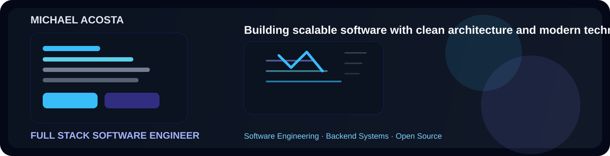

# Michael Acosta

  

  

  Full Stack Developer building reliable web applications, maintainable systems, and modern engineering experiences.

  
  
  
  

---

## About Me

I am a Full Stack Developer from the Dominican Republic focused on building reliable software, clear architecture, and thoughtful product experiences. My work combines backend discipline, modern frontend execution, and a consistent commitment to clean engineering.

---

## Current Focus

- Software Architecture
- Full Stack Development
- Artificial Intelligence
- AI Integration
- Performance Optimization
- Scalable Web Applications
- Modern Backend Development
- Open Source

---

## Tech Stack

### Programming Languages

  
  
  
  
  
  
  
  

### Frontend

  
  
  
  
  
  

### Backend

  
  
  
  
  
  

### Architecture

  
  
  
  
  
  

### AI

  
  
  
  

### Databases

  
  

### Tools

  
  
  
  
  
  
  

---

## GitHub Analytics

<table width="100%" cellspacing="0" cellpadding="0" style="border-collapse: collapse;">
  <tr>
    <!-- <td width="50%" valign="top" align="center" style="padding: 8px;">
      
    </td> -->
    <td width="50%" valign="top" align="center" style="padding: 8px;">
      
    </td>
  </tr>
</table>

<!-- 

  

 -->

  

<table width="100%" cellspacing="0" cellpadding="0" style="border-collapse: collapse;">
  <tr>
    <td valign="top" align="center" style="padding: 8px;">
      
    </td>
    <td valign="top" align="center" style="padding: 8px;">
      
    </td>
  </tr>
</table>

---

## Featured Projects

### Space Invaders
A remastered version of the original 1978 game built with Ruby and Sinatra.

- Technologies: Ruby, Sinatra, JavaScript
- Repository: [View repository](https://github.com/MichaelAcostaDev/Space_invaders)

### UpTask MVC
Deployment of the UpTask project using Model, View, Controller.

- Technologies: PHP, MVC, HTML5, CSS3
- Repository: [View repository](https://github.com/MichaelAcostaDev/UpTask_MVC)

### App Salon MVC PHP
Deployment of the App Salon MVC PHP project.

- Technologies: PHP, MVC, HTML5, CSS3
- Repository: [View repository](https://github.com/MichaelAcostaDev/app-salon-mvc-php)

### 2048
Deployment of a version of the 2048 game built with Ruby and a bit of vibe coding.

- Technologies: Ruby, JavaScript
- Repository: [View repository](https://github.com/MichaelAcostaDev/2048)

---

## Open Source

I value thoughtful collaboration, clear documentation, and practical engineering work. I am especially interested in contributions that improve maintainability, developer experience, and the long-term quality of software.

---

## Current Goals

- Build scalable software with strong architecture and maintainability.
- Continue mastering software architecture and system design.
- Contribute to open source projects with meaningful impact.
- Develop AI-powered applications that solve real problems.
- Continue improving technical judgment and engineering discipline.

---

## Connect With Me

  
  
  
  

---

## Contribution Snake

  

---

  

  Built with care for clarity, reliability, and modern engineering.

